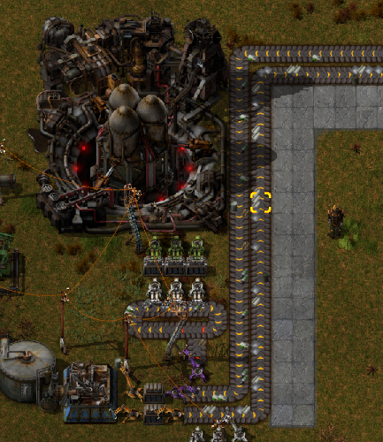
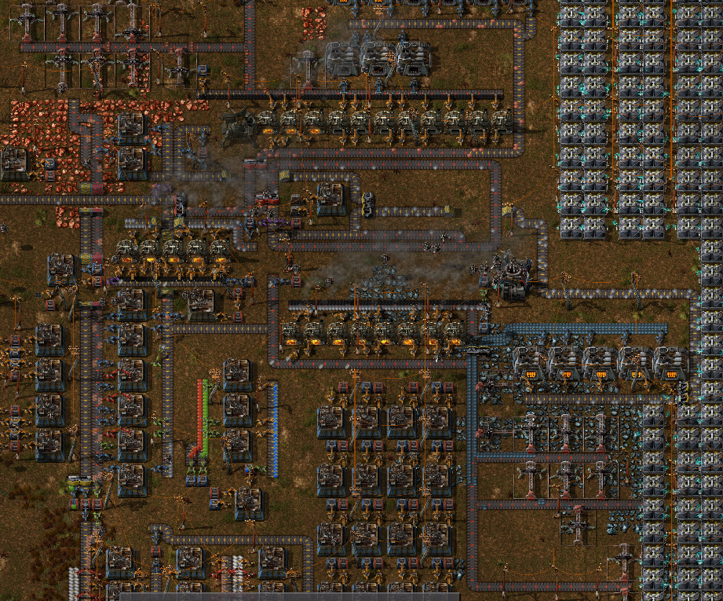

# Conveyor Loops

## Description

Factorio is a game in which the player must build an elaborate network of machinery and conveyor belts to produce increasingly complex goods until they finally build a rocket. Players quickly find that loops of conveyor belts can be extremely useful.

You are presented with a grid of 1m x 1m squares, each being empty or having a single conveyor belt. 

Each conveyor belt moves resources UP, LEFT, DOWN, or RIGHT; this direction does not change. All conveyor belts move at the same speed. Empty spaces do not move resources.

Find the longest loop of conveyor belts. In other words, determine the longest path a resource could take before returning to its starting position.

## Input

The first is two space-separated integers r and c (1 ≤ r, c ≤ 10,000), the number of rows and columns in the conveyor belt grid, respectively. The next r lines of input each consist of c space-separated characters: `^` (UP), `>` (RIGHT), `<` (LEFT), `V` (DOWN), or `-` (EMPTY).

## Output

Output the length of the largest loop of conveyor belts. If no loops exist, output 0.

## Examples

<table>
    <tr>
        <th>Input</th>
        <th>Input</th>
        <th>Input</th>
    </tr>
    <tr>
        <td valign="top">
<pre>1 2
> &lt;</pre>
        </td>
        <td valign="top">
<pre>5 5
> > > > V
^ - V - V
^ - ^ - V
^ &lt; &lt; - V
^ &lt; &lt; &lt; &lt;</pre>
        </td>
        <td valign="top">
<pre>5 5
> > > > V
^ ^ - - V
- - - - >
V V - - ^
> > > > ></pre>
        </td>
    </tr>
    <tr>
        <th>Output</th>
        <th>Output</th>
        <th>Output</th>
    </tr>
    <tr>
        <td valign="top">
<pre>2</pre>
        </td>
        <td valign="top">
<pre>16</pre>
        </td valign="top">
        <td valign="top">
<pre>0</pre>
		</td>
</table>
