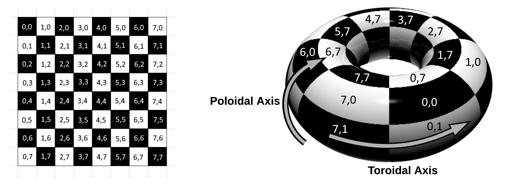

# King's wrapped journey

## Description

Imagine a chess board wrapped around a Torus as shown in the figure below.

    

This wrapping will cause top edge to be connection to the bottom edge of the chess board, as well as left edge to be connected to the right.

A King is a chess piece that may move to any directly adjacent or diagonal square in a single turn. Calculate the minimum number of turns required for a King to travel from a given starting position to a given destination.

## Input

The first line is a number *N*. *N* testcases follow. Each test case consists of two space-separated coordinates. Each coordinate will appear on a separate line of input.

## Output

Output a single integer for each test case indicating the minimum number of turns that are required for the king to move from the given starting coordinates to the given destination coordinates.

## Examples

<table>
    <tr>
        <th>Input</th>
        <th>Input</th>
    </tr>
    <tr>
        <td valign="top">
<pre>1
0 0
0 1</pre>
        </td>
        <td valign="top">
<pre>2
0 0
1 2
0 0
7 7</pre>
        </td>
    </tr>
    <tr>
        <th>Output</th>
        <th>Output</th>
    </tr>
    <tr>
        <td valign="top">
<pre>1</pre>
        </td>
        <td valign="top">
<pre>2
1
</pre>
        </td>
    </tr>
</table>
